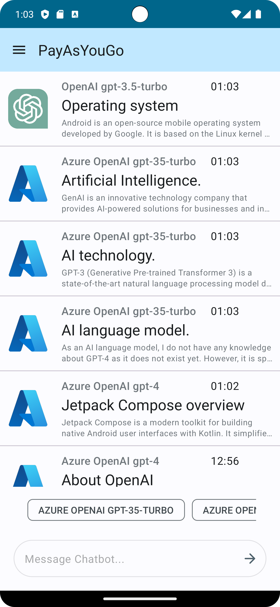
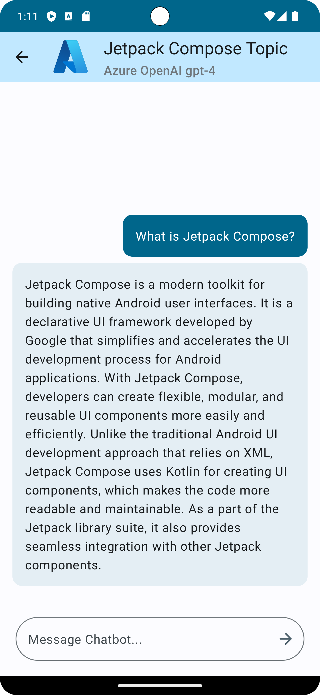
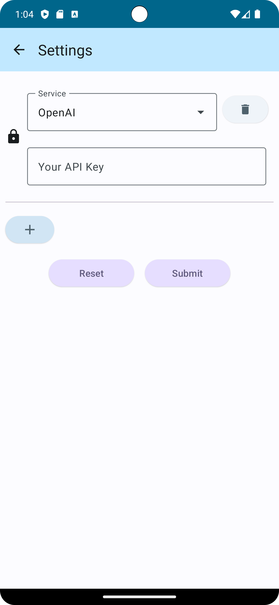

# Android-ChatBot

This project introduces a pay-as-you-go application that offers users access to chat bot services such as GPT-4 through straightforward API key request. Users can submit their OpenAI API key to the application. Subsequently, the application will use the provided API key to generate content based on the user input prompt with the OpenAI models.  

The application is developed using Kotlin. The frontend is developed using Jetpack Compose and the backend is developed using Jetpack Room.

# Installation

SDK: Amazon Corretto version 19.0.2  
Android SDK: Android API 34  
Android Studio: Android Studio Giraffe | 2022.3.1 Patch 1  

# Screenshots
<table>
    <tr>
        <td>  </td>
        <td>  </td>
        <td>  </td>
    </tr>
</table>
